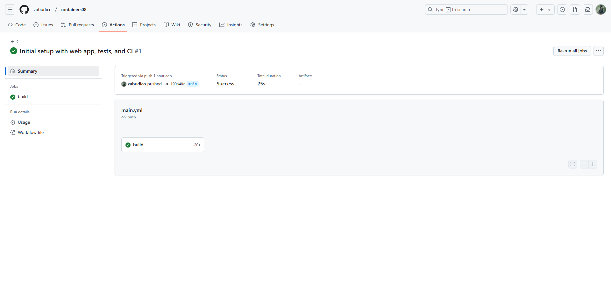
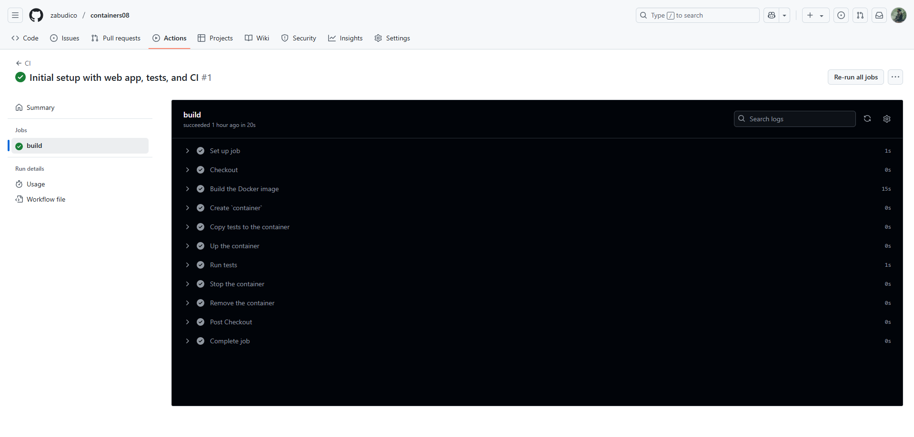
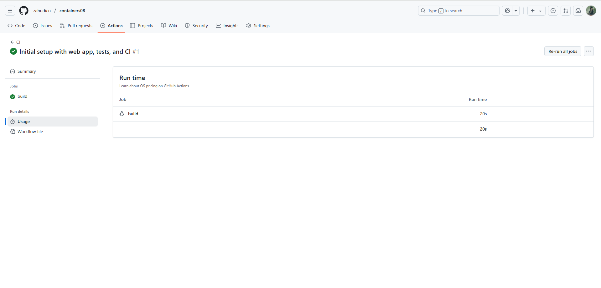
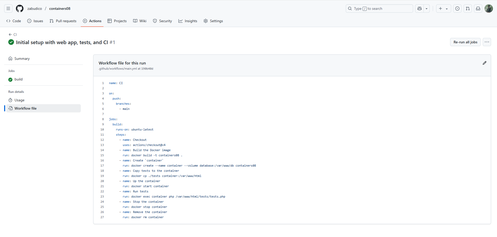

# containers08

IWNO8: Непрерывная интеграция с помощью Github Actions

## Цель работы

Научиться настраивать непрерывную интеграцию (CI) с помощью GitHub Actions для автоматизации тестирования веб-приложения на базе контейнеров.

## Задание

Создать веб-приложение на PHP, написать для него тесты и настроить непрерывную интеграцию с использованием GitHub Actions на основе Docker-контейнеров.

## Подготовка

Для выполнения работы я установил Docker на свой компьютер.

## Выполнение

### 1. Создание репозитория

- Я создал репозиторий `containers08` на GitHub.

- Склонировал его на локальный компьютер с помощью команды:

  ```bash
  git clone https://github.com/zabudico/containers08.git
  ```

### 2. Создание директории для веб-приложения

- В корневой директории `containers08` я создал папку `./site` для размещения веб-приложения на PHP.

### 3. Создание веб-приложения

- В директории `./site` я создал следующую структуру файлов:

  ```
  site
  ├── modules/
  │   ├── database.php
  │   └── page.php
  ├── templates/
  │   └── index.tpl
  ├── styles/
  │   └── style.css
  ├── config.php
  └── index.php
  ```

#### 3.1. Файл `modules/database.php`

- Содержит класс `Database` для работы с базой данных SQLite.
- Реализованы методы:
  - `__construct($path)` — принимает путь к файлу базы данных SQLite.
  - `Execute($sql)` — выполняет SQL-запрос.
  - `Fetch($sql)` — возвращает результат запроса как ассоциативный массив.
  - `Create($table, $data)` — создаёт запись в таблице и возвращает её ID.
  - `Read($table, $id)` — возвращает запись по ID.
  - `Update($table, $id, $data)` — обновляет запись по ID.
  - `Delete($table, $id)` — удаляет запись по ID.
  - `Count($table)` — возвращает количество записей в таблице.

#### 3.2. Файл `modules/page.php`

- Содержит класс `Page` для работы с шаблонами страниц.
- Реализованы методы:
  - `__construct($template)` — принимает путь к шаблону страницы.
  - `Render($data)` — отображает страницу, подставляя данные в шаблон.

#### 3.3. Файл `templates/index.tpl`

- Содержит HTML-шаблон главной страницы приложения.

#### 3.4. Файл `styles/style.css`

- Определяет стили оформления веб-страницы.

#### 3.5. Файл `index.php`

- Содержит код для отображения страницы с использованием классов `Database` и `Page`:

  ```php
  <?php
  require_once __DIR__ . '/modules/database.php';
  require_once __DIR__ . '/modules/page.php';
  require_once __DIR__ . '/config.php';

  $db = new Database($config["db"]["path"]);
  $page = new Page(__DIR__ . '/templates/index.tpl');
  $pageId = $_GET['page'];
  $data = $db->Read("page", $pageId);
  echo $page->Render($data);
  ```

#### 3.6. Файл `config.php`

- Содержит настройки подключения к базе данных (путь к файлу SQLite).

### 4. Подготовка SQL-файла для базы данных

- Я создал директорию `./sql` в корне репозитория.

- В ней создал файл `schema.sql`:

  ```sql
  CREATE TABLE page (
      id INTEGER PRIMARY KEY AUTOINCREMENT,
      title TEXT,
      content TEXT
  );

  INSERT INTO page (title, content) VALUES ('Page 1', 'Content 1');
  INSERT INTO page (title, content) VALUES ('Page 2', 'Content 2');
  INSERT INTO page (title, content) VALUES ('Page 3', 'Content 3');
  ```

### 5. Создание тестов

- Я создал директорию `./tests` в корне репозитория.
- В ней создал файлы `testframework.php` и `tests.php`.

#### 5.1. Файл `testframework.php`

- Содержит простой фреймворк для тестирования:

  ```php
  <?php
  function message($type, $message) {
      $time = date('Y-m-d H:i:s');
      echo "{$time} [{$type}] {$message}" . PHP_EOL;
  }

  function info($message) {
      message('INFO', $message);
  }

  function error($message) {
      message('ERROR', $message);
  }

  function assertExpression($expression, $pass = 'Pass', $fail = 'Fail'): bool {
      if ($expression) {
          info($pass);
          return true;
      }
      error($fail);
      return false;
  }

  class TestFramework {
      private $tests = [];
      private $success = 0;

      public function add($name, $test) {
          $this->tests[$name] = $test;
      }

      public function run() {
          foreach ($this->tests as $name => $test) {
              info("Running test {$name}");
              if ($test()) {
                  $this->success++;
              }
              info("End test {$name}");
          }
      }

      public function getResult() {
          return "{$this->success} / " . count($this->tests);
      }
  }
  ```

#### 5.2. Файл `tests.php`

- Содержит тесты для классов `Database` и `Page`:

  ```php
  <?php
  require_once __DIR__ . '/testframework.php';
  require_once __DIR__ . '/../config.php';
  require_once __DIR__ . '/../modules/database.php';
  require_once __DIR__ . '/../modules/page.php';

  $testFramework = new TestFramework();

  function testDbConnection() {
      global $config;
      $db = new Database($config["db"]["path"]);
      return assertExpression($db !== null, "Database connected", "Database connection failed");
  }

  function testDbCount() {
      global $config;
      $db = new Database($config["db"]["path"]);
      $count = $db->Count("page");
      return assertExpression($count == 3, "Count is correct", "Count failed");
  }

  function testDbCreate() {
      global $config;
      $db = new Database($config["db"]["path"]);
      $id = $db->Create("page", ["title" => "Test", "content" => "Test content"]);
      return assertExpression($id > 0, "Record created", "Create failed");
  }

  function testDbRead() {
      global $config;
      $db = new Database($config["db"]["path"]);
      $data = $db->Read("page", 1);
      return assertExpression($data["title"] == "Page 1", "Read successful", "Read failed");
  }

  $testFramework->add('Database connection', 'testDbConnection');
  $testFramework->add('Table count', 'testDbCount');
  $testFramework->add('Data create', 'testDbCreate');
  $testFramework->add('Data read', 'testDbRead');

  $testFramework->run();
  echo $testFramework->getResult();
  ```

### 6. Создание Dockerfile

- В корне репозитория я создал файл `Dockerfile`:

  ```dockerfile
  FROM php:7.4-fpm as base

  RUN apt-get update && \
      apt-get install -y sqlite3 libsqlite3-dev && \
      docker-php-ext-install pdo_sqlite

  VOLUME ["/var/www/db"]

  COPY sql/schema.sql /var/www/db/schema.sql

  RUN echo "prepare database" && \
      cat /var/www/db/schema.sql | sqlite3 /var/www/db/db.sqlite && \
      chmod 777 /var/www/db/db.sqlite && \
      rm -rf /var/www/db/schema.sql && \
      echo "database is ready"

  COPY site /var/www/html
  ```

### 7. Настройка GitHub Actions

- В директории `.github/workflows` я создал файл `main.yml`:

  ```yaml
  name: CI

  on:
    push:
      branches:
        - main

  jobs:
    build:
      runs-on: ubuntu-latest
      steps:
        - name: Checkout
          uses: actions/checkout@v4
        - name: Build the Docker image
          run: docker build -t containers08 .
        - name: Create `container`
          run: docker create --name container --volume database:/var/www/db containers08
        - name: Copy tests to the container
          run: docker cp ./tests container:/var/www/html
        - name: Up the container
          run: docker start container
        - name: Run tests
          run: docker exec container php /var/www/html/tests/tests.php
        - name: Stop the container
          run: docker stop container
        - name: Remove the container
          run: docker rm container
  ```

### 8. Запуск и тестирование

- Я отправил изменения в репозиторий командой `git push`.
- Во вкладке Actions на GitHub проверил успешное выполнение тестов.









### 9. Создание отчета

- В корне репозитория я создал файл `README.md` с описанием проекта.

## Ответы на вопросы

1. **Что такое непрерывная интеграция?**\
   Непрерывная интеграция (CI) — это практика, при которой изменения в коде регулярно вносятся в общий репозиторий, после чего автоматически выполняются сборка и тестирование для выявления ошибок.

2. **Для чего нужны юнит-тесты? Как часто их нужно запускать?**\
   Юнит-тесты проверяют работу отдельных модулей кода. Их нужно запускать при каждом изменении кода для оперативного обнаружения ошибок.

3. **Что нужно изменить в файле** `.github/workflows/main.yml`**, чтобы тесты запускались при каждом создании Pull Request?**\
   Добавить событие `pull_request` в раздел `on`:

   ```yaml
   on:
     push:
       branches:
         - main
     pull_request:
       branches:
         - main
   ```

4. **Что нужно добавить в файл** `.github/workflows/main.yml`**, чтобы удалять созданные образы после выполнения тестов?**\
   Добавить шаг:

   ```yaml
   - name: Remove Docker image
     run: docker rmi containers08
   ```

## Выводы

В ходе работы я разработал веб-приложение на PHP, написал тесты для его компонентов и настроил непрерывную интеграцию с использованием GitHub Actions и Docker. Это позволило автоматизировать тестирование и обеспечить стабильность приложения.


## Библиография
Docker Documentation
Официальная документация Docker.
Доступно на: https://docs.docker.com/

PHP Documentation
Официальная документация PHP.
Доступно на: https://www.php.net/docs.php

SQLite Documentation
Документация SQLite.
Доступно на: https://www.sqlite.org/docs.html
